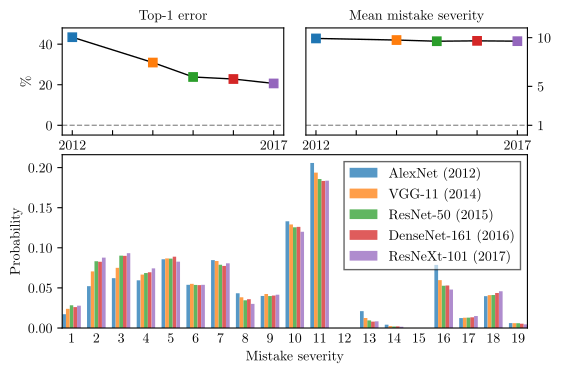

# Making better mistakes

This repository contains the code for the paper:

**[Making Better Mistakes: Leveraging Class Hierarchies with Deep Networks](https://arxiv.org/abs/1912.09393)**  
Luca Bertinetto*, Romain Mueller*, Konstantinos Tertikas, Sina Samangooei, Nicholas A. Lord*.  
_IEEE Conference on Computer Vision and Pattern Recognition (CVPR) 2020_

Resources:
* [Latest version on arXiv](https://arxiv.org/abs/1912.09393)
* [CVPR 2020 open-access](http://openaccess.thecvf.com/content_CVPR_2020/html/Bertinetto_Making_Better_Mistakes_Leveraging_Class_Hierarchies_With_Deep_Networks_CVPR_2020_paper.html)
* [Short video presentation](https://www.youtube.com/watch?v=SIHI8458Fkk)

If you find our work useful/interesting, please consider citing it as:
```
@InProceedings{bertinetto2020making,
author = {Bertinetto, Luca and Mueller, Romain and Tertikas, Konstantinos and Samangooei, Sina and Lord, Nicholas A.},
title = {Making Better Mistakes: Leveraging Class Hierarchies With Deep Networks},
booktitle = {The IEEE/CVF Conference on Computer Vision and Pattern Recognition (CVPR)},
month = {June},
year = {2020}
} 
```

<div align="center">
  
</div>

## Data preparation

 * Download train+val sets of ImageNet-ILSVRC12 and/or train+val sets of [iNaturalist'19](https://github.com/visipedia/inat_comp)
 * Create the dataset by using the splits described in `dataset_splits/splits_tiered.zip` and `dataset_splits/splits_inat19.zip`.
 * For our experiments, we resized the images (stretching them) to 224x224. [This script](https://github.com/jvlmdr/trackdat/blob/master/scripts/resize_images.sh) is convenient for this purpose.
 * Rename `data_paths.yml.example` and edit it to reflect the paths on your system. 

## Installation

The training/testing environment can be initialized using conda as:
```
conda env update -n better-mistakes -f environment.yml
source activate better-mistakes
pip install -e .
```
Alternatively, we provide a Dockerfile that can be built using:
```
docker build -t better-mistakes .
```
 
## Hierarchies

The hierarchies are defined in `./data` for the datasets `tieredImageNet-H` and `iNaturalist19`. `ImageNet-H` is also avaialble for future convenience.
For each of these datasets we provide the following files:
* `dataset_isa.txt`, a text file containing all parent -> child relationships in the hierarchy.
* `dataset_tree.pkl` a pickled `nltk.Tree` containing the hierarchy.
* `dataset_ilsvrc_distances.txt.xz`, a compressed text file with every node pair and their ilsvrc distance.    Note that the pairs are sorted lexicographically.
* `dataset_ilsvrc_distances.pkl.xz`, pickled dictionary of the above distances.

## Running the code

The experiments of the papers are contained in the `experiments/` directory. Inside of your environment (or docker) run for example:
```
cd experiments
bash crossentropy_inaturalist19.sh
```

The entry points for the code are all inside of `scripts/`:
* `start_training.py` runs training and validation for all the methods (note: the code has been tested on single-gpu mode only)
* `plot_tradeoffs.py` produces the main plots of the paper given the json files produced by `start_training.py`
* `start_testing.py` runs the trained model on the test set for the epochs output by `plot_tradeoffs.py` (as in `experiment_to_best_epoch.json`).

## License

This work is licensed under a [Creative Commons Attribution-NonCommercial-ShareAlike 4.0 International License](https://creativecommons.org/licenses/by-nc-sa/4.0/).
Commercial licenses available upon request.

